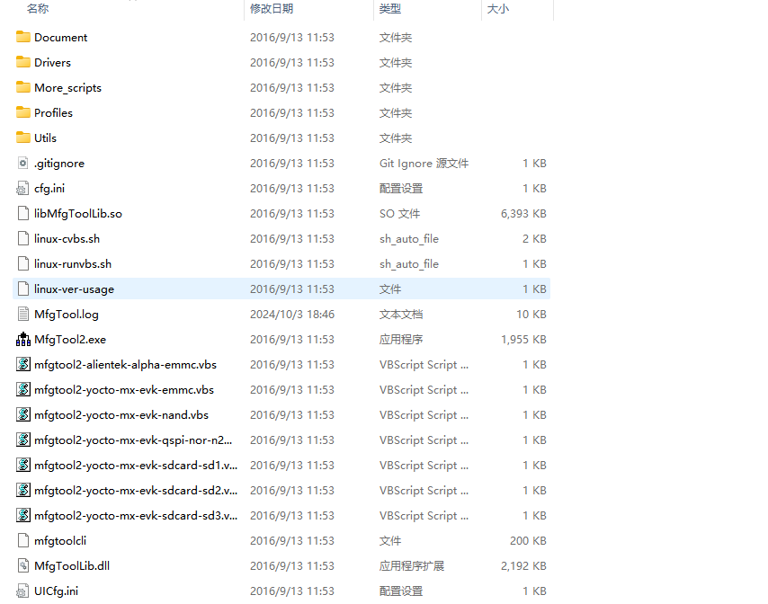
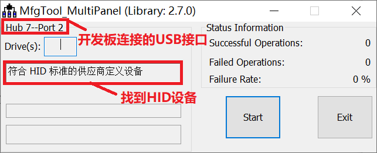
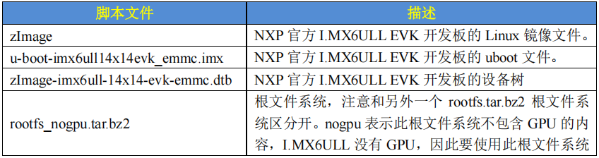
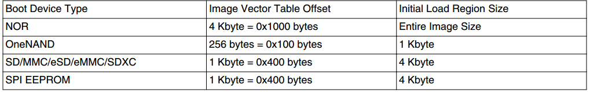

# 使用正点原子官方工具烧写

恩智浦提供了官方的OTG模式的镜像文件烧写软件**mfgtool**。

下载官方mfgtool工具，里面有两个压缩包，后缀分别是`without-rootfs`和`with-rootfs`。我们选择带根文件系统的。对其解压会出现一系列文件。



在上面的文件目录中，重点关注**Profiles**这个文件夹`./Profile/linux/OS Firmware`，我们的烧写文件就放到这个文件夹中。`Mfgtool2.exe`就是烧写软件。要烧写到什么芯片呢，烧写什么介质中，这些通过`vbs`文件来配置。正点原子开发板使用的是emmc的存储介质，使用的是`mfgtool2-yocto-mx-evk-emmc.vbs`。

烧写的时候连接开发板的`USB-OTG1`接口，启动方式设置为`USB`模式，拔出SD卡。按下开发板复位键PC就会识别到块设备。

开发板与电脑连接之后打开`vbs`，出现下面的页面,点击start即可开始烧写。



我们烧写的文件有四个：**uboot, zImage, dtb, rootfs**。现在要确定这四个文件要放到哪里。`./Profile/linux/OS Firmware`中有两个文件夹`files` `firmware`以及文件`ucl2.xml`，mfgtool烧写分为两个阶段。

1. `firmware`文件夹存在`uboot zImage dtb`通过USB OTG将这个文件下载到开发板的`DDR`中，在`DDR`中启动Linux系统，为后面的烧写做准备。
2. `files`文件夹中存放着最终要烧录的`uboot zImage dtb rootfs`文件，经过第一步的操作，开发板上已经运行着一个Linux系统了，此时可以完成对EMMC的格式化，分区操作，EMMC分区建立好之后就可以从`files`文件夹中读取要烧写的文件，烧写到EMMC中。
3. `ucl2.xml`文件配置向什么介质烧写系统，向什么芯片烧写系统。

上述两步中都是将自己编译出来的文件改名，然后对目标文件进行一个替换。



# 使用SD卡烧写

```sh
./imxdownload uboot.bin /dev/sdb

# uboot启动后配置环境变量
=> fatls mmc  1:1
  6785480   zimage 
    39459   imx6ull-14x14-emmc-4.3-480x272-c.dtb 
    39459   imx6ull-14x14-emmc-4.3-800x480-c.dtb 
    39459   imx6ull-14x14-emmc-7-800x480-c.dtb 
    39459   imx6ull-14x14-emmc-7-1024x600-c.dtb 
    39459   imx6ull-14x14-emmc-10.1-1280x800-c.dtb 
    40295   imx6ull-14x14-emmc-hdmi.dtb 
    40203   imx6ull-14x14-emmc-vga.dtb 

8 file(s), 0 dir(s)
bootcmd='fatload mmc 1:1 80800000 zImage;fatload mmc 1:1 830000000 imx6ull-14x14-emmc-7-1024x600-c.dtb; bootz 80800000 - 83000000'
bootargs='console=ttymxc0,115200 root=/dev/mmcblk1p2 rootwait rw'

mmcblk1p2:
    1：设备的编号（从 0 开始计数）。
    mmcblk0：通常是系统内置的 eMMC 或第一个 SD 卡插槽。
    mmcblk1：第二个 MMC 设备（如外接 SD 卡或第二个 eMMC）。
    p2：分区的编号（从 1 开始计数）。
    p1：第一个分区（如 /boot 或 EFI 系统分区）。
    p2：第二个分区（通常是根文件系统 / 或用户数据分区）。
```

```sh
# 为SD卡创建分区
sudo fdisk -l
NAME        MAJ:MIN RM   SIZE RO TYPE MOUNTPOINT
sda           8:0    0 238.5G  0 disk 
└─sda1        8:1    0 238.5G  0 part /
mmcblk0     179:0    0  29.8G  0 disk 
├─mmcblk0p1 179:1    0   256M  0 part /boot
└─mmcblk0p2 179:2    0  29.5G  0 part /home
mmcblk1     179:8    0  14.9G  0 disk  # 这是新插入的 SD 卡（未分区）

sudo fdisk /dev/mmcblk1  # 替换为你的 SD 卡设备路径

# 创建第一个分区（如 512MB 的 FAT32 引导分区）
Command (m for help): n		# 输入 n 创建新分区
Partition type: p			# 主分区（primary）
Partition number: 1			# 分区号（默认 1）
First sector: 2048			# 起始扇区（默认 2048，直接回车）
Last sector: +512M  		# 结束扇区512MB
 
# 创建第二个分区（剩余空间）
Command (m for help): n
Partition type: p
Partition number: 2
First sector: (直接回车，使用默认值)
Last sector: (直接回车，使用剩余空间)

Command (m for help): t  # 修改分区类型
Partition number: 1     # 选择分区
Hex code (type L to list): 1  # 输入类型代码（1=FAT32，83=Linux，EF=EFI）

Command (m for help): w  # 写入并退出

sudo mkfs.vfat -F 32 /dev/mmcblk1p2  # 格式化第二个分区为 FAT32

sudo mkdir /mnt/sdcard  # 创建挂载点
sudo mount /dev/mmcblk1p1 /mnt/sdcard  # 挂载分区


```

# 使用tftp网络文件系统烧写

```sh
bootcmd=tftp 80800000 zImage;tftp 83000000 imx6ull-alientek-emmc.dtb;bootz 80800000 - 83000000
bootargs=console=ttymxc0,115200 root=/dev/nfs rw nfsroot=192.168.1.250:/home/zuozhongkai/linux/nfs/rootfs ip=192.168.1.251:192.168.1.250:192.168.1.1:255.255.255.0::eth0:off

/lib/modules/4.1.15
```

# 裸机的启动

boot ROM会对系统时钟进行初始化，`System PLL=528Mhz，USB PLL=480MHz，AHB=132MHz，IPG=66MHz。`在下载镜像的时候`L1 IC0ache`会打开，验证镜像的时候`L1 DCache、L2 Cache`和`MMU`都会打开。验证完成之后全部关闭。中断向量偏移会设置到boot ROM的起始位置，用户代码被启动后中断向量偏移会被重新设置，一般是设置到用户代码开始的时候。

在设置好启动方式时，如SD卡启动，root ROM会到SD卡的指定位置寻找裸机程序，因此烧录程序`imxdownload `会把裸机程序烧录到SD卡的指定位置，如下图。IVT的偏移为1KB，IVT+Boot data+DCD的总长为4KB-1KB=3KB。



以uboot为例，因为uboot本身是一个庞大的裸机项目。i.MX6ULL的裸机编程涉及三个文件：`start.S` `uboor.bin` `lds` `imx`。

向SD卡烧写.bin文件的命令：`./imxdownload led.bin /dev/sdd` 。这个命令会生成一个`load.imx`文件，相比于.bin文件多出了一些头部信息。那么这个头部信息是什么呢？

## IMX文件

`.imx`文件的组成如下：

1. IVT(Image vector table)。包含一系列地址信息，在ROM按照固定的地址存放着。
   1. entry定义了程序的入口地址0X87800000，从连接脚本文件定义而来。
   2. dcd保存了DCD地址
   3. boot data保存了boot data的地址
2. Boot data。包含镜像要拷贝到DDR的哪个地址，拷贝的大小是多少。
   1. start保存着整个load.imx的起始地址0X877FF000。
3. DCD(Device configuration data)。DDR的初始化配置信息。
4. bin文件。实际的可执行文件。

## LD文件

首先，链接脚本指定了cpu从DDR中读取指令的位置。或者说把可执行文件从ROM放到DDR中的位置。分配了各个区的地址。

```sh
SECTIONS{
    . = 0X87800000;							# 链接起始地址为0X87800000
    .text :									# 代码段地址0X87800000，存放顺序为start.o main.o 
    {
        start.o 
        main.o 
        *(.text)
    }
    .rodata ALIGN(4) : {*(.rodata*)} 		# 常量区
    .data ALIGN(4) : { *(.data) } 			# 初始化的全局变量
    __bss_start = .; 						# 静态变量区
    .bss ALIGN(4) : { *(.bss) *(COMMON) } 
    __bss_end = .;
}
```

## start.S

建立中断向量表

初始化CPU工作模式

分配栈指针

跳转main函数

提供基本的 IRQ 中断处理框架

## 裸机程序编译烧写的命令

```shell
arm-linux-gnueabihf-ld -Timx6ul.lds -o ledc.elf start.o main.o
arm-linux-gnueabihf-objcopy -O binary -S ledc.elf ledc.bin
arm-linux-gnueabihf-objdump -D -m arm ledc.elf > ledc.dis

# 第一个命令是把start.o和main.o链接为elf文件
# 第二个命令把elf文件objcopy为bin文件
# 第三个命令反编译为汇编
```

# bin文件和elf文件的区别

首先elf可执行文件通常运行在操作系统之上。bin文件通常用于嵌入式裸机程序的烧录。

bin文件是存粹的机器码，没有说明书。bin文件是赤裸的，它假设加载它的环境（如嵌入式系统的引导程序）已经预先知道了**代码存放的地址，代码的入口，数据段，代码段的地址。**

elf文件是带有详细说明书和装配图的文件。elf文件有以下几个部分**ELF头部，程序头表，节区，节头表**

1. ELF头部

   1. 标识这是一个ELF文件，文件类型可重定位文件还是共享库文件，ARM架构。

   2. e_entry：程序的入口地址，第一条指令的虚拟地址。

      **对于动态链接的程序，这个地址通常不是 `main` 函数，而是动态链接器 `_start` 的入口**。

   3. 程序头表和节头表的偏移。

2. 程序头表

   加载说明书，用于告诉操作系统如何将elf文件的内容的映射到内存中，以创建一个进程。

   程序头表是一个结构体数组，每个结构体（segment）描述了文件中的一块区域应该如何被映射到内存中。

   1. PT_LOAD：代码段，数据段等需要被加载到内存中的段。
   2. PT_DYNAMIC：包含动态链接信息的段。
   3. PT_INTERP：动态链接器的路径（lib/ld-linux.so.2）。

   每个程序头都包含了该段在文件中的偏移，在内存中的虚拟地址，大小，执行权限等。

3. 节区

   链接器和调试工具的零件清单，保存着不同节的具体内容。

   1. `.text`：存放程序指令（代码）。
   2. `.data`：存放已初始化的全局变量和静态变量。
   3. `.bss`：存放未初始化的全局变量和静态变量（此节在文件中不占空间，只在运行时在内存中分配）。
   4. `.rodata`：存放只读数据（如常量字符串）。
   5. `.symtab`：符号表，记录了函数和变量的名称及其地址。
   6. `.strtab`：字符串表，存放符号名、文件名等字符串。
   7. `.rel.text` / `.rel.data`：重定位信息，用于链接时修正地址。

4. 节头表

   所有节的索引目录。存放一个数组，数组中的每个元素对应一个节，描述了该节的名称（在`.strtab`中的索引），类型，在文件中的偏移，大小，链接信息等。

### elf文件的加载过程

1. shell调用，shell会fork一个子进程，然后execve跳转到elf可执行文件中。
2. 跳转到内核
   1. 读取**elf头部**。验证是不是elf文件，读取头部信息，找到程序头表。
   2. 解析**程序头表**。寻找PT_LOAD段，这是唯一需要被实际加载到内存中的段，通常一个ELF文件至少有两个PT_LOAD段，即代码段和数据段。
   3. 在找到**PT_LOAD**段之后，加载器会为当前进程创建一个新的虚拟内存区域，起始地址和大小`PT_LOAD->p_vaddr`和`PT_LOAD->p_memsz`决定。设置权限。
   4. 上面的步骤建立了进程的虚拟内存区域，现在需要完成**虚拟内存区域到物理内存的映射**。需要注意的是这个映射并不是把磁盘的所有内容都直接复制到内存里面，而是在MMU触发缺页中断的时候才从磁盘中把需要的数据放入内存。
   5. 处理**.bss段**，其在二进制文件中不占用空间，但是需要在内存中为其分配`p_memsz`的空间。
   6. 寻找程序头表中的**PT_INTERP**段，其存放着**动态链接器**的路径，加载器会把这个动态链接器也放到进程的虚拟内存中。
   7. 设置栈。内核会在进程空间地址顶端创建一个栈区域，压入一些数据，传入参数个数，传入参数指针，指向各环境变量的字符串等和一些辅助向量。
      - `AT_ENTRY`：程序的入口点地址。
      - `AT_PHDR`：程序头表在内存中的地址。
      - `AT_PHENT`：程序头表中每个条目的大小。
      - `AT_PHNUM`：程序头表中条目的数量。
      - `AT_RANDOM`：16字节的随机数，用于地址空间布局随机化，增加安全性。
      - ...
3. 从内核跳转到用户空间
   1. 内核将指令指针PC设置为**动态链接器**的入口。栈指针指向刚刚的栈顶，切换到用户模式。
   2. **动态链接器 `_start` 函数开始运行**。
   3. 读取主程序的 `.dynamic` 节区，找到程序依赖的共享库列表，加载这些库。
   4. 上一步动态库加载了之后就有了地址，此时就需要对库函数地址（占位符）进行替换为真实的虚拟地址。
   5. 执行主程序和各个共享库的初始化代码。
   6. 跳转main函数执行。
